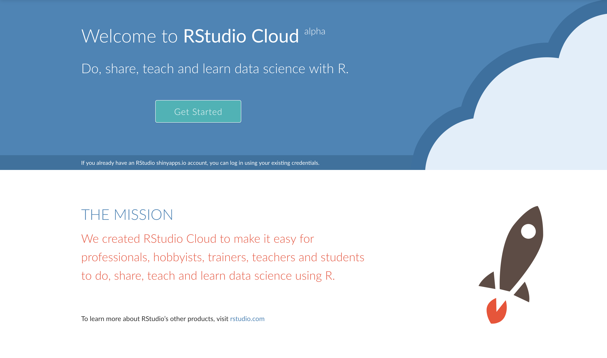
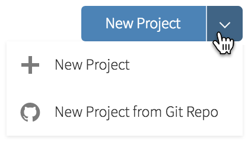
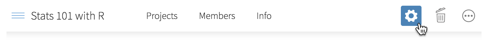
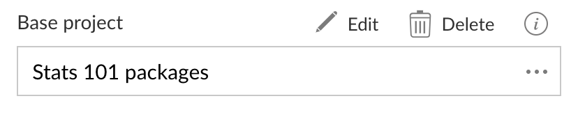
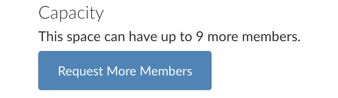

```{r setup, include=FALSE}
knitr::opts_chunk$set(echo = TRUE)
```

class: panel-narrow-slide
## Day 1: hello R

---

class: panel-narrow-slide
## Day 1: hello R ... eventually

- install R

--
.
--
.
--
.

--

- install RStudio

--
.
--
.
--
.

--

- install packages

--
.
--
.
--
.

--

- troubleshoot installation problems

--
.
--
.
--
.
--
 ...
--
 ...
--
 ...

--

`print("hello R")`

--


---

class: panel-narrow-slide
## Day 1: hello R -- right now!

1. [https://rstudio.cloud](https://rstudio.cloud)

--

2. log in (or sign up)

--

3. create a new project

--
...

--

`print("hello R!")`

---

class: panel-narrow-slide
## Day 1: hello R -- eventually

- install R ...

- install RStudio ...

- install packages ...

- troubleshoot installation problems ... ... ... ...

`print("hello R")`

--

---
class: panel-narrow-slide

<span class="cloud-home"></span>


---
class: panel-narrow-slide
## Basic terminology: projects and spaces

--

A **project** is a fundamental unit of work.

--

A **space** is a place for a group of people to collaborate on work.

--

Spaces are great for classwork!

---
class: panel-narrow-slide
## Basic terminology: roles

--

**Admin**: can view, manage and edit all projects, manage space membership, and delete the space itself. 
**Good for: instructors.**

--

**Moderator**: can view, manage, and edit all projects in the space. 
**Good for: TAs.**

--

**Contributor**: see public projects in the space, and create new projects in the space. 
**Good for: students.**

--

**Viewer**: see public projects in the space. Cannot create new projects. 
**Good for: visitors.**

---
class: panel-narrow-slide
## Basic terminology: visibility

A project can be **public** or **private**.

--

Private projects in a space can be viewed by the author *and* space admins and moderators.

--

Private projects have a lock icon: <span class="lock"></span>

---
class: blank-slide, blue, center, middle
## Data Science 101

---
class: panel-narrow-slide
## What else?

--

New project from a git repo: <span class="ridiculously-full-thumbnail inline-image"></span>

--

Use a **base project** to include a default set of packages and files:

<span class="thumbnail"></span>

<span class="full-thumbnail"></span>

---
class: panel-narrow-slide
## Limits

RStudio Cloud is currently in Alpha.

--

No simultaneous, collaborative editing.

--

Projects are limited to 1 GB of RAM.

--

Can create 1 additional space with up to 10 members and 25 projects (by default).


<span class="extra-full-thumbnail"></span>

---
class: panel-narrow-slide
## Best practices, in summary

--

Use RStudio Cloud for teaching!

--

Use spaces for courses, sections, and workshops

--

Make use of Assignments in spaces

--

Set space roles and permissions

--

Test things out ahead of time


---
class: panel-narrow-slide
## Wrapping up

--

RStudio Cloud: not *just* for education

--

We created RStudio Cloud to make it easy for professionals, hobbyists, trainers, teachers and students to do, share, teach and learn data science using R.

Try it out: [https://rstudio.cloud](https://rstudio.cloud)

Talk to us: [https://community.rstudio.com](https://community.rstudio.com/c/rstudio-cloud)

---
class: blank-slide, blue, center, middle

## Thank you!